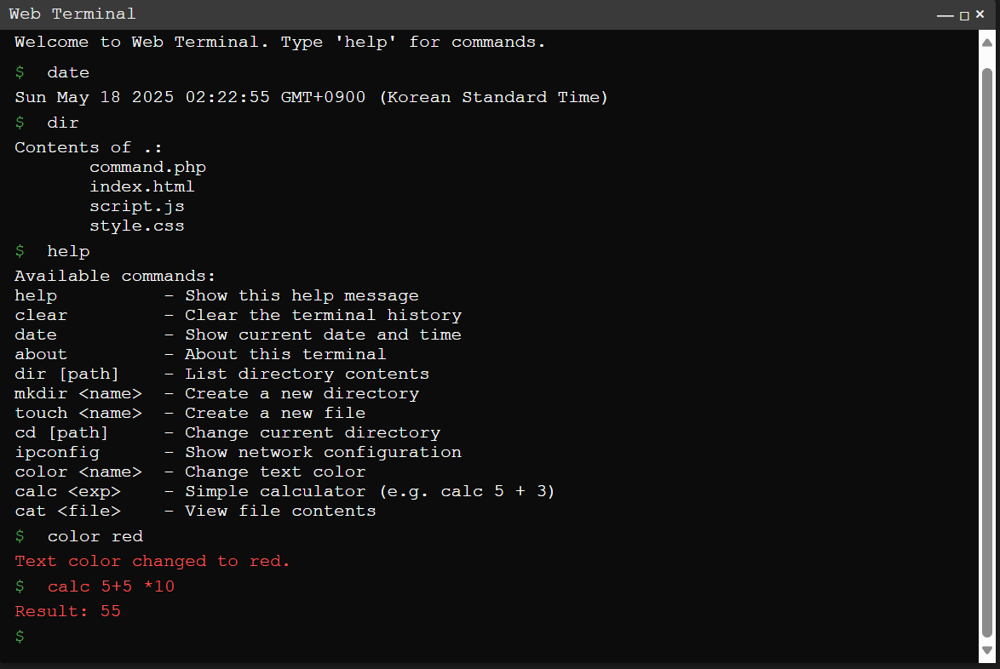

# 🖥️ Web Terminal Simulation

A browser-based terminal interface that replicates real command-line behavior using **HTML, CSS, JavaScript, and PHP**.

## 🚀 Features

- **Command Support**: `help`, `clear`, `date`, `mkdir`, `touch`, `cd`, `dir`, `ipconfig`, `color`, `calc`, `cat`, and aliases like `ls`, `clr`.
- **Color Themes**: Change text color using commands like `color red`, `color green`, etc.
- **File Simulation**: Mimics file operations like directory creation and file viewing with PHP backend support.
- **Auto-Completion**: Press `Tab` to auto-complete commands.
- **Command History**: Navigate previous commands using the up/down arrow keys (stored in localStorage).
- **Inline Calculator**: Evaluate expressions with `calc 5 + 2`.
- **Responsive UI**: Styled using plain CSS for a minimal and clean terminal look.

## 🛠️ Tech Stack

- **Frontend**: HTML, Vanilla JavaScript, Plain CSS
- **Backend**: PHP
- **Storage**: localStorage (for history)
- **Communication**: fetch API for async server interaction

## 📁 Project Structure

```
/index.html        # Main HTML file
/style.css         # Terminal styles
/script.js         # Terminal logic and command processing
/command.php       # Server-side logic for file operations
```

## 📷 Screenshot

 <!-- Add your own screenshot if needed -->

## 📦 How to Run

1. Clone the repository:
   ```bash
   git clone https://github.com/your-username/web-terminal.git
   ```

2. Place the project in a PHP-enabled server (e.g., XAMPP `htdocs` folder).

3. Start your local server and open:
   ```
   http://localhost/web-terminal/index.html
   ```

## 🧠 Credits

Created by Dhirendra kathayat — inspired by classic OS terminal environments.

---

Enjoy using this web-based terminal! Feel free to contribute or fork the project.
